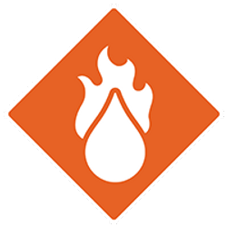

# Zustände [S. 22-23]

Platziere einen Marker (weder Segen  noch Fluch ) in der entsprechenden Sektion der Monster-Statistik-Karte
- Bedingungen bleiben bestehen, bis die Voraussetzung für ihre Entfernung erfüllt ist.
- Das Erhalten einer doppelten Bedingung ersetzt die vorherige durch die neu angewandte.
- Bosse sind gegen einige Bedingungen immun (siehe Monster-Statistik-Karte)
[S. 32].
- Es können keine Flüche oder Segen angewendet werden, wenn alle Karten im Einsatz sind (verwenden Sie separate 10-Karten-Fluch-Decks für Monster und Charaktere – siehe Beginn des Szenarios).

## Negative Zustände (werden auf alle Ziele der Fähigkeit angewendet)

- Gift : Alle Gegner fügen +1 zu allen Angriffen auf die betroffene Figur hinzu.
- Wunde : Erleidet 1 Schaden zu Beginn ihres Zuges.
Lähmung : Kann keine Bewegungsfähigkeiten ausführen (sofortige Wirkung).
- Entwaffnen : Kann keine Angriffe oder ihre Effekte ausführen (sofortige Wirkung).
- Betäubung : Kann keine Fähigkeiten oder Gegenstände verwenden (sofortige Wirkung). Der Charakter muss einen langen Ruhezug ausführen oder 2 Handkarten in seinem nächsten Zug ablegen.
- Verwirrung : Erleidet einen Nachteil (sofortige Wirkung).
- Fluch : Mische eine Fluchkarte in das nicht-abgelegte Angriffsmodifikator-Deck der Figur. Wenn die Figur gegen Flüche immun ist oder kein Deck hat, füge keine Karte hinzu, aber das Ziel wird betroffen, falls eine Karte gezogen wird.

## Positive Zustände (werden durch spezifische Aktionen auf sich selbst oder Verbündete angewendet)

- Unsichtbar : Kann weder fokussiert noch von gezielten Fähigkeiten („Ziel“ oder „Angriff“) des Feindes betroffen werden. Monster behandeln - unsichtbare Feinde als Hindernisse.
- Stärkung : Erhält Vorteil (sofortige Wirkung).
- Segen : Mische eine Segenkarte in das nicht-abgelegte Angriffsmodifikator-Deck der Figur (falls vorhanden).
