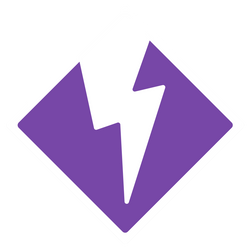

---
layout:
  title:
    visible: true
  description:
    visible: false
  tableOfContents:
    visible: true
  outline:
    visible: true
  pagination:
    visible: true
---

# Zustände

[Spielanleitung S. 22-23](https://amagino.ch/media/33/d4/b7/1604342770/Gloomhaven%20Spielanleitung_DE.pdf)

Platziere einen Marker (weder **Segen**  noch **Fluch** ) in der entsprechenden Sektion der **Monster-Statistik-Karte**

* **Bedingungen** bleiben bestehen, bis die Voraussetzung für ihre Entfernung erfüllt ist.
* Das Erhalten einer doppelten **Bedingung** ersetzt die vorherige durch die neu angewandte.
* **Bosse** sind gegen einige **Zustände** immun (siehe **Monster-Statistik-Karte**) \[[S. 32](https://amagino.ch/media/33/d4/b7/1604342770/Gloomhaven%20Spielanleitung_DE.pdf)].
* Es können keine **Flüche** oder **Segen** angewendet werden, wenn alle Karten im Einsatz sind (verwenden Sie separate 10 Karten **Fluch** Decks für Monster und Charaktere – siehe Beginn des Szenarios).

## Negative Zustände

Werden auf alle Ziele der Fähigkeit angewendet.

* **Gift** : Alle Gegner fügen +1 zu allen Angriffen auf die betroffene Figur hinzu. Wenn eine Heil Fähigkeit auf die vergiftete Figure angewendet wurde, wird der Zustand **Gift** entfernt. Die **Heil** Fähigkeit hat keinen anderen Effekt.
* **Wunde** : Erleidet 1 Schaden zu Beginn ihres Zuges. Wenn eine **Heil** Fähigkeit auf die vergiftete Figure angewendet wurde, wird der Zustand **Wunde** entfernt. Die **Heil** Fähigkeit hat keinen anderen Effekt.
* **Lähmung** : Kann keine **Bewegungsfähigkeiten** ausführen (sofortige Wirkung). Der Zustand **Lähmung** wird am ende seines nächsten Zuges entfernt.
* **Entwaffnen** : Kann keine **Angriffe** oder ihre Effekte ausführen (sofortige Wirkung). Der Zustand **Entwaffnen** wird am ende seines nächsten Zuges entfernt.
* **Betäubung** : Kann keine Fähigkeiten oder Gegenstände verwenden (sofortige Wirkung). Der Charakter muss einen langen Ruhezug ausführen oder 2 Handkarten in seinem nächsten Zug ablegen. Der Zustand **Betäuben** wird am ende seines nächsten Zuges entfernt.
* **Verwirrung** : Erleidet einen **Nachteil** (sofortige Wirkung). Der Zustand **Verwirrung** wird am ende seines nächsten Zuges entfernt. Der Zustand **Verwirrung** wird am ende seines nächsten Zuges entfernt.
* **Fluch** : Mische eine **Fluch** Karte in das nicht-abgelegte **Angriffsmodifikator-Deck** der Figur. Wenn die Figur gegen **Flüche** immun ist oder kein Deck hat, füge keine Karte hinzu, aber das Ziel wird betroffen, falls eine Karte gezogen wird. Wenn eine **Fluch** Karte gezogen wird, wird sie anschliessend in den **Angriffsmodifikator-Ablagestapel** gemischt. Am Ende des Scenarios wird sie aus dem Deck entfernt.

## Positive Zustände&#x20;

Werden durch spezifische Aktionen auf sich selbst oder Verbündete angewendet.

* **Unsichtbar** : Kann weder **fokussiert** noch von gezielten Fähigkeiten („Ziel“ oder „Angriff“) des Feindes betroffen werden. Monster behandeln - unsichtbare Feinde als **Hindernisse**. Der Zustand **Unsichtbar** wird am ende seines nächsten Zuges entfernt.
* **Stärkung** : Erhält **Vorteil** (sofortige Wirkung). Der Zustand **Stärkungrrung** wird am ende seines nächsten Zuges entfernt.
* **Segen** : Mische eine **Segen** Karte in das nicht-abgelegte **Angriffsmodifikator-Deck** der Figur (falls vorhanden). Wenn eine **Segen** Karte gezogen wird, wird sie anschliessend in den **Angriffsmodifikator-Ablagestapel** gemischt. Am Ende des Scenarios wid sie aus dem Deck entfernt.
